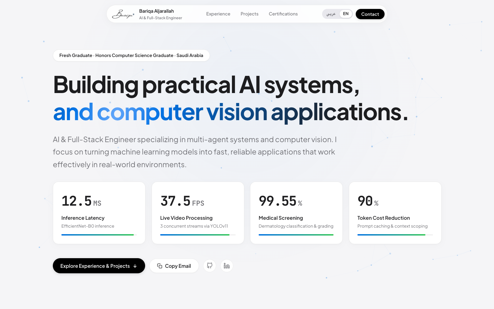

  <picture>
    <source media="(prefers-color-scheme: dark)" srcset="https://readme-typing-svg.demolab.com?font=Fira+Code&weight=600&size=28&pause=1200&color=FFFFFF&width=650&lines=Hi%2C+I'm+Bariqa;AI+Engineer+%26+Full-Stack+Developer" />
    <source media="(prefers-color-scheme: light)" srcset="https://readme-typing-svg.demolab.com?font=Fira+Code&weight=600&size=28&pause=1200&color=000000&width=650&lines=Hi%2C+I'm+Bariqa;AI+Engineer+%26+Full-Stack+Developer" />
    
  </picture>

  

Honors Computer Science Graduate, AI Engineer, and Full-Stack Developer bridging the gap between cutting-edge machine intelligence and intuitive applications. Specializing in orchestrating Autonomous Multi-Agent systems, designing Edge Computer Vision pipelines, and architecting robust end-to-end platforms.

  

---

## Key Benchmarks

- **12.5ms** Edge Inference Latency (Clinical EfficientNet-B0)
- **37.5 FPS** Concurrent Video Stream Processing (YOLOv11 & TensorRT)
- **99.55%** Clinical Adjacent Accuracy (Hierarchical Diagnosis)
- **90%** LLM Token Optimization via Semantic Caching & Geofencing

---

## Flagship Systems

1. **AuraX** — Autonomous Multi-Agent Industrial Safety & Hazard Mitigation Platform.
2. **DermaSense** — Hierarchical Two-Stage Deep Learning Clinical Dermatology Screening.
3. **Attocus** — Autonomous Socratic Multi-Agent Study Co-Pilot with In-Memory Edge Vision.
4. **UniClubs** — Production Flutter Mobile App with Hybrid Recommendation Engine (TFRS) & LightGBM Attendance Forecasting.

---

## Stack & Architecture

- **Core Technologies**: Python, PyTorch, TensorRT, FastAPI, TypeScript, React, Flutter
- **AI Architectures**: LangGraph StateGraph, Autonomous Multi-Agent Orchestration, YOLOv11 Edge Vision
- **Design & UI**: Apple Keynote Materiality, Spring Physics, Specular Glare Tracking, Atomic RTL/LTR toggle

---

## Connect

---

&copy; 2026 Bariqa Aljarallah · Kingdom of Saudi Arabia
